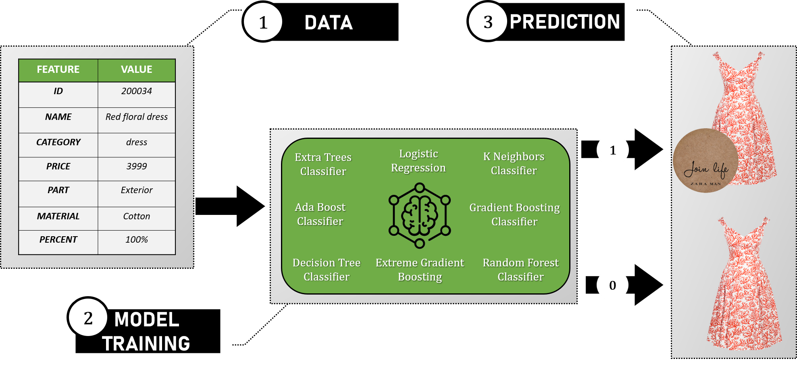

[](https://github.com)
[](https://www.python.org/)
[](https://github.com/Naereen/badges/)
[](https://github.com/Naereen/badges)


</p>


<br>
<p align=center style="font-size: 45px;">
	<b>Zara Ethic Fashion Analysis</b>
	<br>
	<br>
	
	<br>
</p>
<br>

Description & Content
-----------------------------------------------
This project is a simple Data Science analysis based on the _Fast Fashion Eco Commitment Dataset_ available on the `zenodo` public Hub.
<p align=center>
	<a href="https://doi.org/10.5281/zenodo.4261101">
	 	
	</a>
</p>

The first objective of this study is to collect, clean and analyse **spanish Zara items** thought a basic [Exploratory Data Analysis]("EDA.ipynb").
Next, several models will be created during the [Machine Learning Analysis]("MLA.ipynb") with the aim of predicting whether or not a given garment item has the special Zara **_join life_** ecolabel (_Binary classification_).

<br>


Installation
------------------------------------------------
To have a look and manipulate the main dataset, please consider the following steps:

1. **First, create a copy of the project:**

_Via https_
```shell
git clone https://github.com/pmatran/join-life-detector.git
```
_Via ssh_
```shell
git clone git@github.com:pmatran/join-life-detector.git
```

2. **Then, enter in main repository**

```shell
cd join-life-detector/
```

3. **Next, make sure to install all dependencies:**

```shell
pip install -r requirements.txt
```

<br>


Get started
-----------------------------------------------

**_Start the Exploraroty Data Analysis_**
```shell
jupyter notebook EDA.ipynb
```

**_Start the Machine Learning Analysis_**
```shell
jupyter notebook MLA.ipynb
```

**_Start the model interactive dashboard_**
```shell
python dashboard.py
```

**_Start the model interactive model prediction_**
```shell
python app.py
```

<br>


Reports
-----------------------------------------------
If you are interested to have a quick look on raw data, some reports about datasets are availables:

+ [ZARA items](data/reports/items.html)
+ [Garment composition](data/reports/compo.html)

<br>

Contributing
------------------------------------------------
Bug reports, code contributions, or improvements to the documentation are welcome from the community. 
Feel free to suggest improvements by working with your own fork version of `join-life-detector`. Go to the project page and hit the **Fork** button.
You will want to clone your fork to your machine:

```shell
git clone <url_join-life-detector> <join-life-detector-#yourname>
cd join-life-detector
```

<br>

Ressources
-----------------------------------------------
+ [Pandas documentation](https://pandas.pydata.org/docs/)
+ [Plotly documentation](https://plotly.com/python/)
+ [Scikit-learn documentation](https://scikit-learn.org/stable/)
+ [Pycaret documentation](https://pycaret.readthedocs.io/en/stable/)
+ [Zara Join-life ecolabel](https://www.zara.com/es/en/z-join-life-mkt1399.html?v1=1471713)

<br>

Disclaimer :no_entry:
-----------------------------------------------
This project was created to evaluate the analytic skills of the owner ([@pmatran](https://github.com/pmatran)) by his professor at M2-IASchool (_Bordeaux_, **FRANCE**).

<br>

Coffee beaks :coffee:
-----------------------------------------------
[](https://www.buymeacoffee.com/pmatran)
